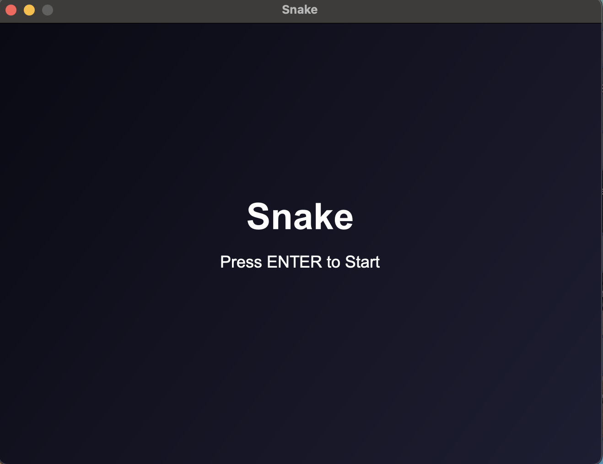
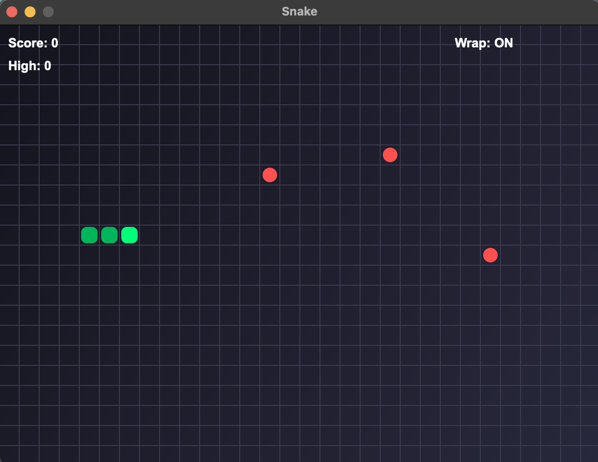
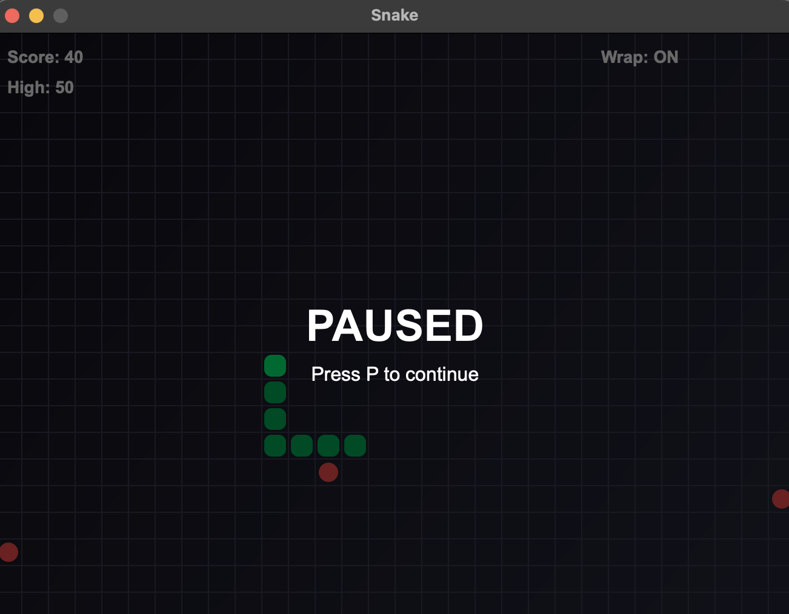
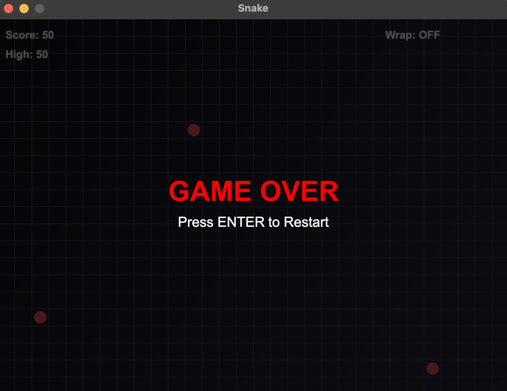

# 🐍 Snake

**Snake** — современная версия классической игры «Змейка», реализованная на **C++ и Qt 6**. Игра сочетает классическую механику с современным визуальным оформлением, анимациями и удобным интерфейсом.

---

## 🎮 Особенности

- Стартовое меню с клавишей **ENTER** для начала игры  
- Несколько яблок на поле  
- Режим прохождения сквозь стены (Wrap Mode)  
- Пауза с анимацией (мигающий текст «PAUSED»)  
- Анимация смерти змейки (сегменты исчезают по одному)  
- Ускорение змейки с ростом счета  
- Отображение текущего счета и рекорда  
- Градиентный фон и сетка  
- Защита от резкого разворота змейки  

---

## ⌨ Управление

| Клавиша        | Действие                         |
|----------------|----------------------------------|
| ↑ / ↓ / ← / →  | Движение змейки                  |
| Space          | Включение/выключение Wrap Mode   |
| P              | Пауза / Продолжение              |
| ENTER          | Старт / Перезапуск игры          |
| ESC            | Выход из игры (только в меню)   |

---

## 🛠 Сборка и запуск

1. Открой проект в **Qt Creator**.  
2. Убедись, что установлен **Qt 6.x** (или Qt 5.15+).  
3. Скомпилируй и запусти проект.  

> В проекте `mainwindow.cpp` содержится вся игровая логика, а `mainwindow.h` — определения переменных и состояний игры.

---

## 📂 Структура проекта
```
SnakePro/
├── main.cpp
├── mainwindow.cpp
├── mainwindow.h
├── SnakePro.pro
└── README.md
```

---

## 📷 Фотографии геймплея

### Main menu


### Snake Gameplay


### Pause


### Game over


---

## 🎯 Планы улучшений

- Сохранение рекорда между запусками через `QSettings`  
- Выбор уровня сложности  
- Эффекты частиц при съедании яблок  
- Звуковое сопровождение  
- Более сложные анимации для паузы и смерти  

---

Выполнил студент Чувилов А.А. из группы ЭФБО-07-24